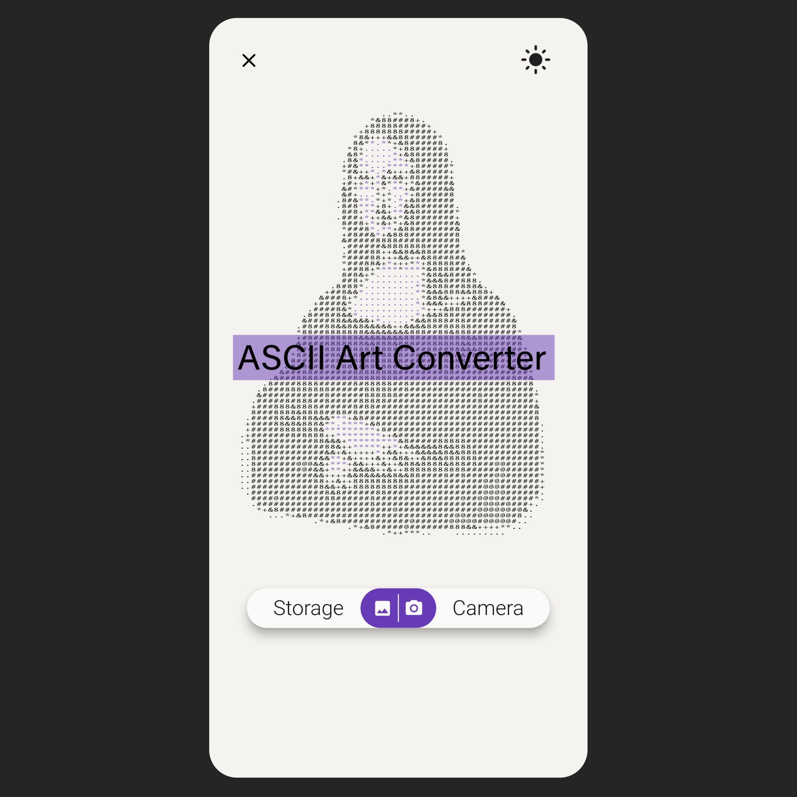
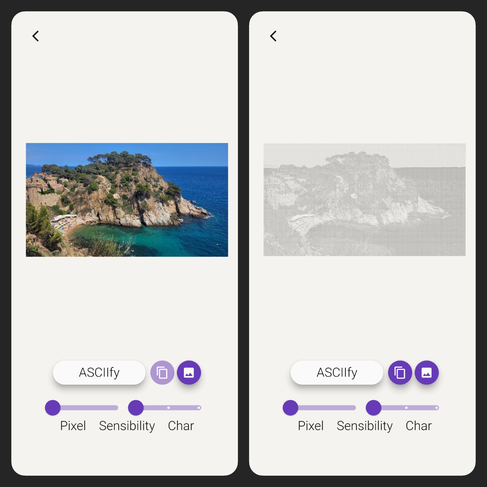
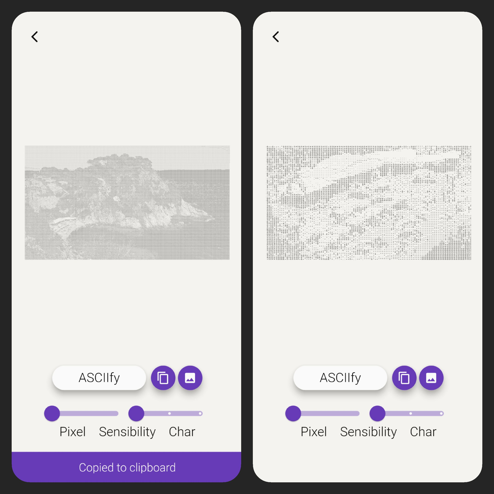
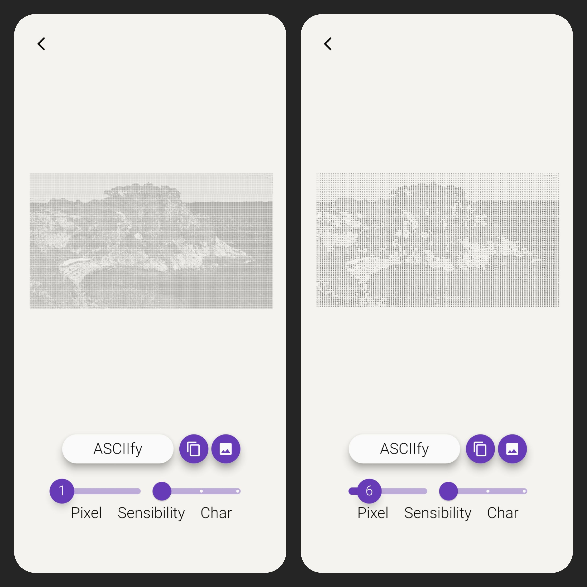
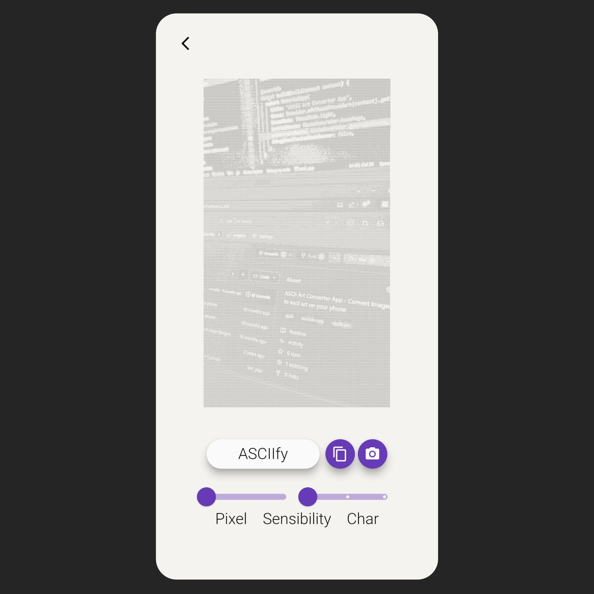
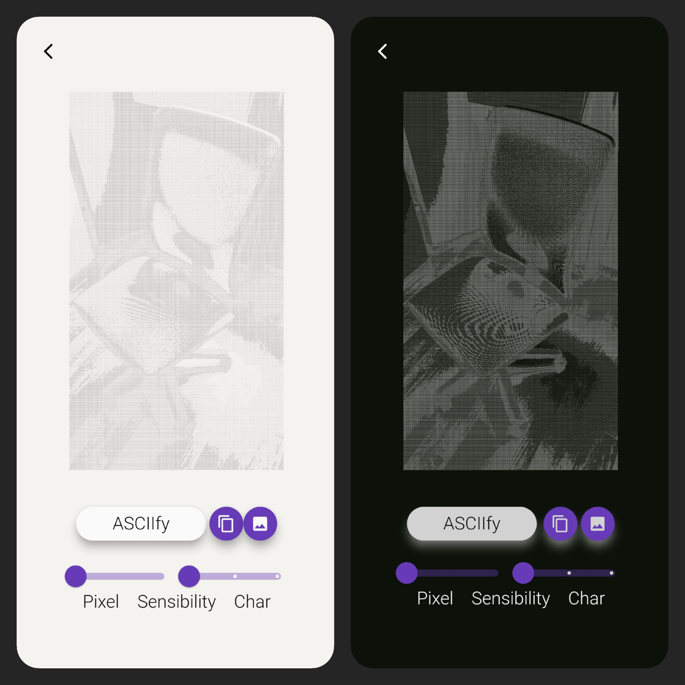

# ASCII Art Converter App

Polished minimal mobile app (for *Android* and *iOS*) developed in *Flutter*, which converts images from the device storage and camera into ASCII art, with various formatting options.

## Features

- *Image selection*: users can choose images from their device storage or capture new ones using the camera.
- *ASCII art conversion*: the app converts the selected image into ASCII art using various formatting options.
- *Formatting options*: users can customize the ASCII art output by adjusting the following parameters: pixels sensitivity and character set.
- *Themes*: light and dark theme.

## Screenshots

Here are some screenshots* of the ASCII Art Converter App in action:

*The screenshots have been compressed, the actual app has a higher quality and resolution.

## Installation

To install and run the ASCII Art Converter App, follow these steps:

1. Clone the repository: `git clone https://github.com/LorenzoProSky/ascii_app.git`
2. Navigate to the project directory: `cd ascii_app`
3. Install dependencies: `flutter pub get`
4. Connect a device (debug USB enabled) or start an emulator
5. Run the app: `flutter run`

Make sure you have Flutter and Dart installed on your machine before running the app.

Alternatively, you can download the APK file from the [apk-releases](resources/release/app-release.apk) and install it on your Android device.

## Possible Additions

- *Color formatting option*: allow users to convert images into colored ASCII art.
- *Screenshots*: add a feature to automatically take screenshots of the ASCII art.
- *Real-time conversion*: convert images into ASCII art in real-time using the device camera.